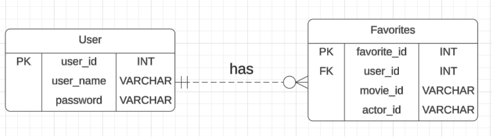

# FilmFinder -- Uncover Your Next Favorite Movie
IS496_Course Mini Project

# About Project
Our group proposes to develop a Movie Recommendation/Search Application by referencing the IMDb database. This application aims to serve movie enthusiasts by providing a user-friendly interface to search and discover movies based on various criteria such as genre, cast, rating, and runtimes. Additionally, it will feature functionalities for users to register/log in to manage the list of their favorite movies. A distinctive aspect of our application will be its ability to handle multiple client requests simultaneously, ensuring a seamless experience for all users.

# Key Functionalities

**Efficient Search**: Implementing an efficient search algorithm to fetch relevant movie information from the vast IMDb database quickly.
- Search based on movie name, genre, year, and actor name.
- Display director, cast members, company and year of search results


**User Authentication**: Securely manage user registration and login processes.


**User Preferences**: Allowing users to save and view the list of their favorite movies, which requires persistent storage.


**Scalability**: Handling multiple client requests without significant delays or server crashes.


## Meet the Team
|     Name      |   NetId    |
| ------------- | ---------- |
| Chenzhao Wang |   cw107    |
|    Zhen Li    |  zhenli6   |


## Install Required Packages
First, ensure that you are using a Linux or macOS system. Then, ensure that you have Python and pip installed on your system. Then, open your terminal or command prompt and run the following command:

   ```bash
   pip install -r requirements.txt
   ```


### Run the Project
1. cd to FilmFinder folder (do not proceed to /app)
2. If you haven't configured the permission for run.sh, run ```chmod +x run.sh``` to give the permission
2. run ```./run.sh```
3. type ```http://127.0.0.1:5010/``` in browser to access the backend server


## User Interface
### [Login & Register Page](https://github.com/moiralala/IS496_Project/tree/main/doc/UI/Login_Page.png)


### [Search Moives & Actors Page](https://github.com/moiralala/IS496_Project/tree/main/doc/UI/Search_Page.png)


### [User Home Page](https://github.com/moiralala/IS496_Project/tree/main/doc/UI/User_Home_Page.png)


# Detailed Introductions

## System Design
During the design stage, we made a sequence diagram to illustrate the expected workflow of our application. 

### [Sequence Diagram](https://github.com/moiralala/IS496_Project/tree/main/doc/System_Design.jpg)


## Frontend

### HTML
`index.html`: The landing page of our site, generally used for login or introductory content (as shown in figure2).

`search.html`: Provides the interface for users to perform searches for movies or actors (as shown in figure3).

`home.html`: Serves as the layout for the user's home page, typically displaying user-specific data like favorites (as shown in figure4).

### JavaScript
`home.js`: Contains JavaScript for interacting with user data on the home page, such as fetching and displaying favorites.

`index.js`: Handles form submissions, validations, and interactions on the index page, such as login or introductory animations.

`search.js`: Manages search functionalities, including sending search queries and displaying results.

### CSS
`home.css`: Styles specific to the home page, including styles for lists of favorites or user profiles.

`index.css`: Provides styling for the landing page, which includes forms, buttons, and basic layout elements.

`search.css`: Custom styles for the search page, which could involve form layouts, result displays, and interactive elements.


## Flask App Routing
`account_routes.py`: This file contains routes for user account-related functionalities such as login and registration.

- Index Route (/): Directly renders the index.html template.
- Login Route (/login):
    - Handles both GET and POST methods.
    - Verifies user credentials. If valid, user details are stored in the session and a success response is sent back; otherwise, an error message is returned.

- Registration Route (/register):
    - Only allows POST requests.
    - Check if a username is available. If so, it registers the user, stores their details in the session, and sends a successful response. If the username is already taken, it returns an error.

`home_route.py`: This file manages the home page of logged-in users.

- User Home Route (/user-home):
    - Renders the home page only if the user is logged in, otherwise returns an error.
- User Favorites API Route (/user-favorites-api):
    - Provides data about the user's favorite movies and actors, available only to logged-in users.

`search_routes.py`: This file defines the functionality for searching movies and managing favorites.

- Search Page Route (/search-page): Renders the search page.
- Search API Route (/search-api):
    - Takes various search parameters (like movie name, actor name, genre, and year) and returns search results. It also validates the year format and handles server errors.
- Add Favorite Route (/add-favorite):
    - Allows users to add movies or actors to their favorites list. It checks for duplicates before adding a new favorite and handles database interactions.


## Backend (utils)
### `account_utils.py`:
It contains utility functions to manage user accounts within our database.

- `register_user(user_name, password)`: Registers a new user with a username and password. This function inserts the user's details into the User table in the database.

- `check_user_cred(user_name, password)`: Validates the credentials of a user attempting to log in. It verifies if the entered username and password match those stored in the database.

- `get_user_id(user_name, password)`: Retrieves the unique identifier (user_id) for a user, based on their username and password. This ID is often used for linking user actions and data within other parts of the application.

- `is_username_available(user_name)`: Checks if a username is available for new user registration, ensuring that users cannot register with a username that is already in use.


### `search_utils.py`:
This is a core component of our Computer Networks course mini-project. It integrates the IMDb API to fetch and process detailed information about movies and actors based on search criteria. 

- **Logging Configuration**: Set up to log debug-level messages which include time stamps and message severity levels to help trace and debug the code execution.

- **IMDb API Initialization**: An instance of the IMDb API is created to enable access to movie and actor data.

- **Caching**: Implemented using lru_cache to optimize performance by reducing the number of repetitive API calls. Two separate caches store results for movie and actor details respectively.

- `process_movies(criteria)`: Allows for searching movies by name, genre, year, and actor. It filters search results based on these criteria and organizes them into detailed summaries.

- `process_actors(criteria)`: Facilitates the search for actors by name. Results include detailed biographical information and a brief filmography.

- **Concurrent Processing**: Utilizes ThreadPoolExecutor to handle movie and actor searches in parallel, improving response time and efficiency.

- `advanced_search_movies_and_actors(criteria)`: Combines the results of both movie and actor searches into a single response, showcasing the integration and functionality of concurrent searches.


### `home_utils.py`:
This script is designed to interact with the IMDb API and our database to fetch and display user-specific data. The key functionalities of this script are encapsulated primarily in the get_user_favorites function. 

- **Initialization of IMDb API**: Creates an instance of the IMDb API to access detailed information about movies and actors.

- `get_user_favorites(user_id)`: Retrieves a user's favorite movies and actors from the Favorites table in our database. This function extracts movie and actor IDs, fetches detailed information for each from the IMDb, and organizes this data into a user-friendly format.

- **Fetching Detailed Data**: For each favorite movie or actor, the function fetches comprehensive details such as movie titles, years, genres, ratings, actor biographies, and key films.

- **Data Organization**: The data retrieved is structured to facilitate easy display on the user’s home page, enhancing the personalized experience by providing quick insights into their favorite movies and actors.


### `database.py`:
It handles the connectivity to our SQLite database, ensuring all other components can interact seamlessly with the database. 

`get_db_connection()`: This function opens a connection to the SQLite database stored in the file FilmFinder.db. It configures the connection to return rows that behave like dictionaries, allowing for easier data manipulation.


### `data_clean.ipynb`
This Jupyter notebook is designed to test data retrieval from the IMDb API and to gather the necessary information efficiently (if you just want to run the project, you do not need to use this file).


### `FilmFinder.db`
This SQLite file is to store data of users' information in `User` table and users' favorites list in `Favorites` table.


## Database Design
### [ER Diagram](https://github.com/moiralala/IS496_Project/tree/main/doc/ER_Diagram.png)


We use the SQLite to build schemas to manage our account and favorite list information.


# External Source
We use the [IMDbPY](https://imdbpy.readthedocs.io/en/latest/) library to access the IMDb database, which serves as the primary external source. This library is instrumental in fetching movie data based on user queries. We integrated this functionality into a scalable network application, developed the user interface, implemented user authentication and preferences management, and ensured the application could handle simultaneous client interactions efficiently. 


# Technical Challenge
The main technical challenge we encountered was the slow search execution time. It takes 
about 40 seconds to search and return a combined search result. 

As an effort, we tried to use the thread pool executor to process movie and actor searches in parallel. We also implement caching to avoid making repeated API calls for the same data. Comparing the execution time of using ThreadPool and not using it, we found the execution time shows no significant improvement. The potential reason for causing this might be due to the response time of the IMDb API servers or the API Rate Limiting. If the IMDb API enforces rate limiting, concurrent requests might not be as effective as expected.


# Demo
https://mediaspace.illinois.edu/media/t/1_s3pkdg56

# Contribution
**Zhen Li**: Outline system architecture and draft initial user interface mock-ups; Set up the development environment and necessary tools; Improve advanced search; Implement a thread pool and cache in the search backend; Conduct testing to identify and fix bugs, and optimize application performance.

**Chenzhao Wang**: Finalize the application features proposal; Integrate IMDbPY for movie data retrieval; Develop initial user authentication flow and database schema for storing user preferences; Develop and refine the user interface based on initial mock-ups; Finalize user authentication and enable users to save and view favorite movies.


